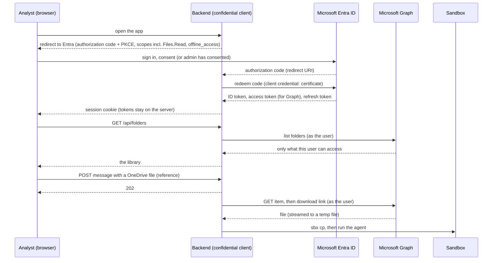

# OneDrive integration: plan and outline

How to take the OneDrive integration from "works against a stand-in" to "analysts use it against the bank's real
Microsoft 365 tenant, each seeing only their own documents".

> **Status of this document.** It is a **plan**. A first OneDrive adapter already exists
> ([integrations.md](integrations.md#onedrive-through-microsoft-graph)) and is tested against an in-process stand-in for
> Microsoft Graph, but it has never run against a real tenant, and it reads **one configured drive with one
> application-wide credential**. Section 2 describes the code as it is today (and is checked against the code by
> `DocumentationTest`). Everything after it is a proposal: names such as `UserTokens` or `harness.auth.mode` **do not
> exist yet**. Effort sizes are rough (S is under a day, M is two to four days, L is one to two weeks, for one developer who
> knows the code).
>
> Statements about Microsoft's platform come from Microsoft's documentation as read on 2026-10-01 (listed in
> [References](#15-references)). Where something could not be confirmed it is marked **(verify)**.

## Contents

1. [Goals, non-goals, and the promise to keep](#1-goals-non-goals-and-the-promise-to-keep)
2. [Current state](#2-current-state)
3. [Decisions to make first](#3-decisions-to-make-first)
4. [Target architecture](#4-target-architecture)
5. [Microsoft-side setup](#5-microsoft-side-setup)
6. [Implementation plan by phase](#6-implementation-plan-by-phase)
7. [API and contract changes](#7-api-and-contract-changes)
8. [Delivering documents to the sandbox](#8-delivering-documents-to-the-sandbox)
9. [Reliability and performance](#9-reliability-and-performance)
10. [Security and compliance](#10-security-and-compliance)
11. [Testing strategy](#11-testing-strategy)
12. [Rollout](#12-rollout)
13. [Risks and open questions](#13-risks-and-open-questions)
14. [Backlog](#14-backlog)
15. [References](#15-references)

---

## 1. Goals, non-goals, and the promise to keep

### The promise the product already makes

The connect dialog tells every analyst: *"The agent can read documents in connected folders. **Access follows your
Microsoft 365 permissions.**"* (`pickerDesc` in `Bank Agent Harness.dc.html`.) Today that sentence is **not true**: the
adapter reads whatever one shared credential can read. For a bank, making it true is the point of this work, so it
shapes almost every decision below.

### Goals

1. **Per-user access.** An analyst can only connect, browse, attach and have the agent read documents that *they* can
   open in Microsoft 365. Access is enforced by Microsoft's permission model, not re-implemented by us.
2. **Real folders and documents.** The library, the attach dialog and the files the agent reads come from the analyst's
   OneDrive for Business and (decision D3) the SharePoint document libraries they can reach.
3. **Safe delivery to the agent.** Documents reach the sandbox correctly (size, type, integrity), without leaking
   credentials, and with a record of who gave which document to the agent.
4. **Operable.** Throttling, expiry, revocation and outages degrade gracefully and are visible.
5. **The API stays language-neutral.** Changes go into `openapi.yaml`, so the planned Python backend can match them.

### Non-goals (for this plan)

- **Writing to OneDrive.** The agent reads. No upload of results, no edits. (Everything below asks for read
  permissions only.)
- **Indexing or searching document contents ourselves.** The agent reads the files it is given.
- **Personal Microsoft accounts.** Work or school accounts only.
- **Replacing the fakes.** The fake catalog stays the default so the demo runs with nothing installed.
- **Sign-in for anything other than documents.** This plan introduces sign-in because documents need it; it does not
  design roles or entitlements beyond "who is this".

---

## 2. Current state

What exists today, verified against the code. Anything not listed here does not exist.

### What is built

| Capability | Where | Behaviour |
|---|---|---|
| The port | `DocumentCatalog` | `folders()`, `files(FolderId)` and `fetch(String fileName)`; failures are `DocumentSourceException` |
| The Graph adapter | `GraphDocumentCatalog` | Lists a drive's sub-folders, a folder's files, and finds a file **by exact name** with the drive search, then downloads through the pre-authenticated link |
| Tokens | `GraphTokenProvider` | Either a configured access token, or the client-credentials grant, cached until one minute before expiry |
| Settings | `GraphSettings`, `GraphAdapters` | `harness.graph.*`, including `harness.graph.drive`, `harness.graph.folders-root` and `harness.graph.max-download-bytes` |
| Selection | `Adapters` | `harness.documents.mode=graph` builds it at startup; misconfiguration stops the app |
| Safety limits | `GraphDocumentCatalog` | Bearer token only to the configured host (`sameHostOrFail`), no redirects, 25 pages of 200, size limit, secret never in messages |
| Where files go | `SbxSandboxAgent` | An attached OneDrive file is fetched with `fetch(file.name())`, written to a temp folder and copied into the sandbox with `sbx cp` |
| Per-user folders | `ConnectedFolders` | The aggregate is keyed by `UserId`, but the only value ever used is `UserId.DEMO` |
| The stand-in | `FakeGraphServer` | An in-process HTTP server playing Graph, the token endpoint and the download host; used by `GraphDocumentCatalogTest`, `GraphTokenProviderTest` and `GraphModeTest` |

### How the Graph adapter works today

Requests (each is `GET`, bearer token on all but the last): the drive's `root/children` (or `root:/<folders-root>:/children`)
for folders; `items/{id}/children` for a folder's files; `root/search(q='<name>')` to find a document; `items/{id}` with
`$select=…,@microsoft.graph.downloadUrl` for the link; then a plain `GET` of that link with no token.

### Gaps against the goals

| # | Gap | Evidence in the code | Why it matters |
|---|---|---|---|
| G1 | **No per-user access.** One credential for everyone | `GraphTokenProvider` holds one token or one client-credentials identity; `harness.graph.drive` is a single drive | Breaks the product promise. With the application permission `Files.Read.All` the app can read **every file in the tenant** |
| G2 | **No sign-in, one fixed user** | `UserId.DEMO`; `FolderApplicationService` uses it for every call; `CurrentUserApplicationService` returns configured text | Nothing says *who* is asking, so nothing can be per-user |
| G3 | **Sessions have no owner** | `Session` carries no user id; any caller who knows a session id can read it or message it | Once documents are real, a conversation (which quotes them) must not be readable by another user |
| G4 | **Files are found by name** | `fetch(String fileName)`; `FileRef` is only a name and a source | Duplicate names (common in real libraries) pick the wrong file; and search does not work with the least-privilege app permission (section 3, D1) |
| G5 | **Whole file in memory** | `fetch` returns `Optional<byte[]>`; the limit is 50 MiB | A few concurrent large files exhaust memory |
| G6 | **No retry or back-off** | A 429 becomes a `DocumentSourceException` (502) at once | Microsoft throttles; a busy moment becomes a user-visible failure |
| G7 | **No caching** | Every library or file listing is a fresh request | Slow dialogs; more throttling |
| G8 | **Only one drive, and folders are children of one root** | `GraphSettings.drive`, `foldersRoot` | Real analysts have a personal OneDrive *and* team libraries on SharePoint |
| G9 | **Tokens are needed on a background thread** | `SbxSandboxAgent.stage` runs after the HTTP request has returned | A per-user token has to be available then, and refreshed if needed |
| G10 | **Never run against a real tenant** | The tests use `FakeGraphServer` | Permissions, consent, throttling and real response shapes are unproven |
| G11 | **No audit trail** | Nothing records which document was given to the agent, by whom | A bank will ask |

---

## 3. Decisions to make first

Each decision below changes the work. Decide them (with security and the Microsoft 365 owners) before building
past phase P1. Each has a recommendation and the reasoning, but they are **proposals for people to confirm**.

### D1. Whose identity does the app use to read documents?

| Option | How it works | Access it has | Verdict |
|---|---|---|---|
| **A. Delegated (per-user)** | Each analyst signs in; the backend gets a token *for that user* (authorization-code flow with PKCE) | The **intersection** of what the app is consented for and what the user can access. Microsoft: the application "can never exceed the current user's existing permissions" | **Recommended.** The only option that makes the product promise true |
| B. Application-only, tenant-wide | The app signs in as itself with `Files.Read.All` (application) | Every file in the tenant | **Reject** for production. This is today's design (G1) |
| C. Application-only, scoped | The app signs in as itself with `Sites.Selected` / `Files.SelectedOperations.Selected`, and an admin grants it specific sites or folders | Only the resources an admin granted | Good for a **service mode** (unattended jobs, demos on a fixed library), not for "my documents" |
| D. On-behalf-of | The UI gets a token for *our API*, and the backend exchanges it for a Graph token | Same as A | Only needed if the UI calls the API with bearer tokens directly. Unnecessary with option A and a backend-held session (D4) |

Recommendation: **A for analysts, with C kept as an optional service mode.** Facts that support this:

- Microsoft's guidance on selected permissions: "Application only scenarios have no user present and are considered
  higher risk. With delegated, the application can never exceed the current user's existing permissions … Delegated is
  preferred when possible."
- **The drive search does not support the `Sites.Selected` application permission** (the search API's own note), and the
  current adapter finds documents by search. So option C needs id-based fetching (G4, phase P3) before it can work at all.
- Microsoft says tokens issued for its APIs must not be validated or relied on by our code ("Don't attempt to validate or
  read tokens for any API you don't own"). So the Graph token is only **forwarded**; who the user *is* comes from the
  OpenID Connect ID token (D4).

### D2. Which permissions?

All read-only. For delegated access:

| Permission | Lets the app read | Notes |
|---|---|---|
| `Files.Read` | The signed-in user's own files | The least-privileged permission for downloading, listing and searching a drive (per the Graph docs for `content`, `delta` and `search`) |
| `Files.Read.All` | Files the user can access, including files **shared with them** and SharePoint libraries | Needed if analysts work from team libraries (D3) |
| `Sites.Read.All` | SharePoint sites the user can access | Only if you must enumerate sites; avoid if libraries can be reached through `Files.Read.All` |
| `offline_access`, `openid`, `profile` | Refresh tokens (`offline_access`) and the user's identity | Required for the sign-in flow |
| `User.Read` | The user's basic profile | Optional; the ID token already has the name |

Recommendation: start with `Files.Read` + `offline_access` + `openid` + `profile`; add `Files.Read.All` **only if** D3
includes SharePoint libraries or shared files. Whether a user may consent themselves or an administrator must is a tenant
setting **(verify with the tenant admins)**. Plan for admin consent either way, because a bank should not let users grant
file-read access to applications.

For a scoped service mode (option C): `Sites.Selected` (a site) or `Files.SelectedOperations.Selected` (specific files
or folders) with the **three steps Microsoft requires**: (1) admin consents the permission in Entra ID, (2) an admin grants
the app a role (`read`) on the resource with a `POST …/permissions` call, (3) the app's token carries the scope. If any step
is missing the app has no access, which is the point: an app consented for a "selected" scope starts with **no** access.

### D3. What counts as "the analyst's documents"?

| Scope | Covers | Implication |
|---|---|---|
| Personal OneDrive for Business only | `me/drive` | `Files.Read`; simplest; but bank research usually lives in team libraries |
| Plus SharePoint document libraries | Several drives; the folder paths in the demo data ("Credit Research / Coverage / …", "Shared / …") look like libraries | `Files.Read.All`; **drive ids** appear in every address (see D5) |
| Plus files shared with the user | Search from the drive resource includes shared items, flagged `remoteItem` | More surface; decide if wanted |

Recommendation: ask the business which libraries analysts actually use. Plan for **multiple drives** from the start (the
cost is small, section 4.4) even if the pilot uses one.

### D4. Where does sign-in happen, and who holds the tokens?

| Option | Tokens live in | Notes |
|---|---|---|
| **A. The backend signs the user in (authorization-code flow, confidential client) and keeps the tokens; the browser holds only a session cookie** | The server | **Recommended.** The access and refresh tokens never reach the browser or the UI code. Microsoft recommends a certificate rather than a client secret for confidential clients. Quarkus supports this with its OpenID Connect extension (`quarkus-oidc`), `quarkus.oidc.provider=microsoft`, `application-type=web-app`, an encrypted session cookie, and automatic refresh (`token.refresh-expired`) |
| B. The UI is a single-page app that signs in itself | The browser | Refresh tokens for SPAs last 24 hours (Microsoft's docs) and need the `spa` redirect type; and the *backend* would still need Graph access for background work. Not suitable |

Consequences of A:

- **The UI and the API should share an origin in production** (behind one reverse proxy). The demo serves them from
  different ports, which needs CORS with credentials; workable for development, awkward to secure for production.
- **The user's identity is the OIDC ID token's subject**, mapped to the domain's `UserId`.
- **Background work needs the user's Graph token** (G9): see section 4.3.
- Quarkus caveat from its Microsoft provider guide: Microsoft access tokens may not be in JWT format, so
  `quarkus.oidc.verify-access-token-with-user-info=true` may be needed if the access token is verified at all. We forward the
  Graph token rather than verifying it, so confirm the configuration does not try **(verify)**.

### D5. How is a file identified?

Today by name (G4). Proposed: by **Graph identifiers**. A drive item id is unique only within its drive, so the stable
address of a file is `driveId` + `itemId`, and the same for a folder.

- `FolderId` is already an opaque string, so folders can be addressed as `<driveId>!<itemId>` **with no domain change**
  (the adapter composes and splits it).
- `FileRef` needs one new field, an opaque `reference`, so the agent adapter can fetch the exact file (section 4.4).
- Names stay for display only.
- Microsoft's delta documentation says the same about paths: "When using delta you should always track items by id".

### D6. May a document leave the machine?

`Move to cloud` carries the sandbox's filesystem, including every attached document, to **Docker's hosted service**. For a
bank that is a data-governance decision, not a technical one. Questions for compliance:

- Which documents may be processed in a cloud sandbox at all (by sensitivity label or library)?
- Is the cloud sandbox's region acceptable?
- How long may copies persist in a sandbox (the source sandbox is stopped, not deleted, after a move)?

Recommendation: build a **policy hook** (section 6, phase P6) so the answer can be enforced in one place, and default to
the conservative setting (documents from designated libraries never go to the cloud) until compliance decides.

---

## 4. Target architecture

### 4.1 The flow, per user

The sign-in and token exchange are standard OpenID Connect handled by the Quarkus extension; the new design work is
**everything that has to know who the user is** (sections 4.2 to 4.4).

### 4.2 What changes, by layer

| Layer | Change | New or changed |
|---|---|---|
| `interfaces.rest` | Every endpoint knows the caller; unauthenticated calls get 401; `/api/me` returns the real user; a logout route | changed |
| `application` | Services take the caller's `UserId`; session access checks ownership; a port for the user's Graph credential | changed, new port |
| `domain` | `Session` gets an owner; `DocumentCatalog` methods take the user; `FileRef` gets a reference; documents are opened as a stream or file, not `byte[]` | changed |
| `infrastructure.graph` | Per-user token use, multiple drives, id-based fetch, retry and caching | changed |
| `infrastructure` | A user-token store backed by the OIDC session; an audit logger | new |
| UI | Sign-in gate, real user, folder browser, re-consent and error messages | changed |

### 4.3 Tokens and background work

The agent runs on a background thread long after the HTTP request returned, but it needs the *user's* Graph token to fetch
the files they attached (G9). Options:

| Option | How | Trade-off |
|---|---|---|
| **A. Fetch at send time** | In `sendMessage`, while the request (and the user's session) is alive, download the attached OneDrive files into a per-session staging area; the background task uses only local files | **Recommended for the first version.** No token needed later; failures show immediately as a 4xx/5xx to the analyst. Cost: the request now does I/O before returning 202 (bound it with the size limit and a timeout), and files are fetched even if the agent later fails |
| B. A user-token store | A port (`UserTokens`) returns a fresh access token for a `UserId`, refreshing as needed, usable from any thread | More flexible (lazy fetch, retries after expiry, long sessions); needs a refresh-token store with real security (encrypted, server-side) and revocation handling |

Start with A; introduce B when something needs a token outside a request (for example change tracking, section 9). In both,
a turn can last up to ten minutes (`harness.sbx.turn-timeout`) and a Graph access token lasts roughly an hour (the token
response carries `expires_in`), so a turn never outlives its token, but a *cached* token must not be reused blindly.

### 4.4 Domain and port changes

| Today | Proposed | Ripples to |
|---|---|---|
| `DocumentCatalog.folders()` | `folders(UserId)` | `FolderApplicationService`, `FakeDocumentCatalog`, `GraphDocumentCatalog`, tests |
| `DocumentCatalog.files(FolderId)` | `files(UserId, FolderId)` | same |
| `DocumentCatalog.fetch(String fileName): Optional<byte[]>` | `open(UserId, DocumentRef)`, returning a handle that streams to a file (`Path`) with its size and name | `SbxSandboxAgent.content`, fakes, tests |
| `FileRef(name, source)` | `FileRef(name, source, reference)` where `reference` is opaque (empty for uploads) | `Dtos`, `FileRefDTO`, `Session.filesShared`, demo data |
| `CatalogFile(folderId, name)` | adds `id` (and size) | `CatalogFileDTO`, the attach dialog |
| `Session` (no owner) | `Session.start(id, owner, location, now)`; `owner()` | repositories, `rehydrate`, every session test |
| `FolderApplicationService.USER = UserId.DEMO` | the caller's `UserId` | `FolderApplicationService` and its tests |
| `FolderId` | unchanged type; value becomes `<driveId>!<itemId>` in graph mode | `GraphDocumentCatalog` only |

The aggregates' rules do not change, but **session ownership is a new invariant**: a session is only reachable by its
owner. Enforce it in the application layer and answer **404, not 403**, for someone else's session so ids cannot be probed.

---

## 5. Microsoft-side setup

Work for the **tenant administrators** and the app owner. None of it is code, all of it blocks the code from working.

### 5.1 One-time

1. **Use a test tenant first.** A Microsoft 365 developer or sandbox tenant with a few users, a SharePoint site and
   sample documents. Do not develop against the production tenant.
2. **Register the application** in Microsoft Entra ID as **single-tenant** (the bank's directory only).
3. **Platform:** a **Web** redirect URI for the backend (not "single-page application"). Use exact HTTPS URIs per environment;
   a fixed callback path avoids registering many URIs. Redirect URIs must match exactly.
4. **Credentials:** upload a **certificate** (Microsoft recommends this over a client secret for confidential clients).
   If a secret is used for a pilot, store it in the platform's secret store and rotate it; never in a committed file.
5. **API permissions (delegated):** Microsoft Graph `Files.Read` (and `Files.Read.All` if D3 says so), `offline_access`,
   `openid`, `profile`. **Grant admin consent** for the tenant (D2).
6. **Conditional Access:** find out which policies apply to sign-ins from this app (MFA, compliant device, location) so the
   first real user is not the first to hit them. Token lifetime and revocation policies affect refresh behaviour.
7. **A service-mode registration (optional, option C):** a second registration with `Sites.Selected` or
   `Files.SelectedOperations.Selected`, and the grant calls from section 3 D2, for each site or folder it may read.

### 5.2 Per environment

| Item | Dev | Test | Production |
|---|---|---|---|
| Tenant | Developer tenant | Developer tenant or a bank non-production tenant | The bank's tenant |
| Redirect URI | `http://localhost:…` | the test host over HTTPS | the production host over HTTPS |
| Credential | secret in a local env var | certificate in the test secret store | certificate in the production secret store |
| Consent | self | admin | admin, through change control |

### 5.3 What the backend needs from this

Tenant id, client id, the credential, the redirect URI, and the permission list, as configuration (section 7). Nothing from
the registration is secret except the credential.

---

## 6. Implementation plan by phase

Each phase ends in something demonstrable and leaves the demo (fake catalog, no sign-in) working. Sizes are rough.

### P0. Prove the existing adapter on a real tenant (S to M)

*Purpose: replace assumptions with facts before building on them (G10).*

- Use the **developer tenant** and a configured access token from Microsoft Graph Explorer (the quickest delegated token):
  `HARNESS_GRAPH_ACCESS_TOKEN=… ./mvnw quarkus:dev -Dharness.documents.mode=graph`.
- Run the **smoke checklist in section 11.3** and record the results in this document (paste real response shapes into the
  `FakeGraphServer` fixtures where they differ).
- Learn: do `parentReference.path` values arrive percent-encoded? What does search return for names with apostrophes and
  spaces? What are the actual folder `childCount` values? Is `root:/<path>:/children` accepted for nested paths?
- **Exit:** the library, attach dialog and a real file reaching a sandbox work with a pasted token; differences from the
  stand-in are fixed in the adapter and the stand-in.

### P1. Harden the adapter, still app-wide (M)

*Purpose: make what exists robust before changing who it runs as (G6, G7).*

- **Throttling:** on 429, wait `Retry-After` seconds and retry (bounded attempts), as Microsoft prescribes; with no header,
  exponential back-off; **only for idempotent GETs**. Log the `request-id` from Graph's error body.
- **Timeouts and failure messages** per call; classify 401 (re-auth), 403 (no permission), 404, 429, 5xx distinctly in the
  exception text so the UI can react (section 7).
- **Short-lived cache** for folder and file listings (seconds to a minute), keyed so that it can later include the user.
- **Observability:** counters for requests, 429s and bytes downloaded; a structured log line per document fetch.
- Files: `GraphDocumentCatalog`, `GraphSettings`, new `GraphHttp` helper if the class grows.
- **Exit:** tests show retry on 429 (using `FakeGraphServer`, extended to throttle), cache hit and miss, and clear errors.

### P2. Sign-in and the notion of a user (L)

*Purpose: know who is asking (G2, G3).* Done **without** Graph first, so it can be reviewed on its own.

- Add `quarkus-oidc` with `quarkus.oidc.provider=microsoft`, the tenant's authority, `application-type=web-app`, PKCE
  (`quarkus.oidc.authentication.pkce-required` with a state secret), a fixed callback path, and token refresh.
  A proposed switch, `harness.auth.mode` = `none` (default, today's demo) or `oidc`, keeps the demo running unchanged.
- Map the OIDC subject to the domain's `UserId`; make `CurrentUserApplicationService` read the real name, role and initials.
- **Session ownership:** `Session` gets an owner; services take the caller; others' sessions answer 404 (section 4.4).
  Demo data is owned by the demo user in `none` mode, and by nobody in `oidc` mode (or seeded per user on first sign-in).
- `ConnectedFolders` is already per user: it just receives the real id.
- Endpoints return 401 when unauthenticated; add `GET /auth/login` (or rely on the extension's redirect) and a logout.
- **UI:** send credentials with API calls, handle 401 by going to sign-in, and show the signed-in name.
- **Cross-origin:** either serve UI and API from one origin, or allow credentials in CORS for the development origin only.
- **Exit:** two users in the test tenant each see only their own conversations; an unauthenticated call is 401; the demo
  mode is untouched; `DocumentationTest` and layering tests pass.

### P3. File identity by id (M)

*Purpose: stop finding files by name (G4), a prerequisite for scoped permissions and for duplicate names.*

- `CatalogFile` carries an `id` (the Graph item id, with the drive); the attach dialog sends it; `FileRef` carries the
  opaque `reference`; `SbxSandboxAgent` fetches by reference.
- Remove the search from the fetch path (keep it for an optional "search my documents" feature, P7).
- **Contract:** `CatalogFileDTO` and `FileRefDTO` gain an `id`/`reference` field (optional for uploads), documented in
  `api.md` and regenerated into `openapi.yaml`. Old clients that send only names keep working in fake mode (the fake
  resolves by name), but graph mode requires the reference.
- **Exit:** two files with the same name in different folders are attached and fetched correctly; search is no longer
  needed to attach a file.

### P4. Per-user Graph access (L)

*Purpose: make the promise true (G1, G9).*

- Add the delegated Graph permissions to the sign-in scopes (D2).
- A port for obtaining the current user's Graph credential in the request path (and, for design B in 4.3, a token store).
- `GraphDocumentCatalog` takes the user's token per call instead of holding one (`GraphTokenProvider` remains for the
  service mode, option C).
- **Fetch at send time (4.3, option A):** `sendMessage` downloads the attached OneDrive files into a staging area; the
  background turn uses them. Failures (no permission, file removed, too large) are reported to the analyst immediately.
- **Multiple drives (D3):** `folders(UserId)` returns folders from the user's OneDrive and from the configured SharePoint
  libraries, with ids composed as `<driveId>!<itemId>`.
- **Exit:** user A cannot see or attach a file only user B can open, **verified with two real accounts** (11.3); revoking a
  user's access in Microsoft 365 removes it from the app without a deploy.

### P5. The real folder experience (M)

- A **folder browser** (navigate into sub-folders, breadcrumbs) instead of a flat library, using `children` with paging.
- Optional **search** within the user's documents (the search API, with the caveats in section 9).
- Clear **empty and error states**: not signed in, consent needed, no access to a folder, the file was removed, throttled.
- **Exit:** a new analyst can connect their real folders without help.

### P6. Governance (M to L, depends on compliance answers)

*Purpose: D6 and G11.*

- **Audit log:** an append-only record of *user, document reference, name, size, time, destination (local or cloud),
  session id* for every file handed to an agent, in a store the bank's security team can query. **Never** the content.
- **Cloud policy hook:** one place (an application-layer policy) that decides whether a given document may be copied into a
  cloud sandbox or carried by a move; the move and the cloud-turn paths both consult it. Rules come from configuration or
  from document classification once compliance defines it.
- **Retention:** decide whether staged copies and stopped source sandboxes are deleted after a turn or a move (today they
  are not; see the onboarding guide's rough edges).
- **Exit:** compliance can answer "who gave the agent which document, and where did it go?" from the log.

### P7. Scale and polish (optional)

- **Change tracking** instead of re-listing: Microsoft's delta query (start with `delta`, keep the `deltaLink`, handle
  `410 Gone` by re-enumerating) and, if push is wanted, change notifications. Use only when listings are slow or throttled.
- Caching shared across users **only** for data every user may see; per-user otherwise.
- "Recently used" and "search my documents" features.

---

## 7. API and contract changes

All additions are backward compatible in fake mode. Anything marked **breaking** only affects `graph` + `oidc` mode.

| Change | Endpoint or field | Compatibility |
|---|---|---|
| Authentication | every `/api/*` returns **401** when not signed in (in `oidc` mode) | new status; `none` mode unchanged |
| Real user | `GET /api/me` returns the signed-in user | same shape |
| Sign-in and sign-out | routes for the redirect and logout | new |
| File identity | `CatalogFileDTO` gains `id`; `FileRefDTO` gains `reference` (optional for uploads) | additive |
| Session ownership | other users' sessions answer **404** | behaviour change in `oidc` mode |
| Re-consent | folder and file endpoints can answer **403** with a code the UI understands, distinct from **502** | new codes |
| Browsing | `GET /api/folders/{id}/children` (folders and files, paged) | new |
| Search | `GET /api/documents/search?q=` | new, optional (P5/P7) |

Rules for any change here: update the DTO annotations, run `./mvnw test`, **commit the regenerated `openapi.yaml`**, update
[api.md](api.md) (the documentation test enforces the endpoint list), and tell the owner of the Python backend, since the
contract is shared.

Error-code vocabulary to add to `ApiError.error` (proposal): `unauthenticated` (401), `forbidden` (403, "you can't
open this"), `consent_required` (403, "an administrator must approve"), `document_source_failure` (502, existing),
`throttled` (503 or 429 with `Retry-After` passed through).

---

## 8. Delivering documents to the sandbox

How a OneDrive file becomes a file the agent reads (today in `SbxSandboxAgent.stage`; the end state changes how it is
fetched, not how it is copied).

1. **Resolve** the attached `reference` to a Graph item (drive + item id).
2. **Get the download link:** `GET …/items/{id}?$select=id,name,size,@microsoft.graph.downloadUrl` (or `GET …/content`,
   which answers `302` to the same link). Microsoft: the link is **pre-authenticated, valid for a limited time ("might
   expire within minutes")**, so use it immediately, and send **no** `Authorization` header to it.
3. **Check before downloading:** `size` against the limit; the file type against an allow-list (below).
4. **Stream to a temporary file**, never into a `byte[]` (G5). Large files can use `Range` requests, which go to the download
   link, not to `/content`. Optionally verify the size matches.
5. **Copy into the sandbox** with `sbx cp` into `<workspace>/files/`, then **delete the temporary file**.
6. **Record** the hand-off in the audit log (P6).

Details to decide:

| Question | Proposal |
|---|---|
| File types | An allow-list (PDF, Word, Excel, PowerPoint, text, CSV, images) with a clear message otherwise. Block executables and archives |
| Size | Keep `harness.graph.max-download-bytes`; add a per-turn total |
| Names | A file name from Microsoft is still untrusted: reduce to a base name and refuse path characters (the adapter already refuses names with a path) |
| Download host | The download link is a URL we did not choose. Require `https` and, if possible, a host allow-list for the tenant's SharePoint and OneDrive domains **(verify the exact host suffixes in the real tenant)** |
| Changing files | A file can change between listing and download. Treat the download as authoritative; show the name and modified time the agent actually read |
| Moves | A move copies the sandbox, **including these documents**, to the destination (D6). The policy hook decides if that is allowed |
| Cleanup | Staged temp files are deleted immediately; sandbox copies follow the retention decision (P6) |

---

## 9. Reliability and performance

- **Throttling.** Microsoft Graph answers **429** with a `Retry-After` header; the recommended handling is to wait that long and
  retry, avoid immediate retries (they count against your limits), and fall back to exponential back-off if no header is
  given. Retrying only safe reads keeps this simple. OneDrive and SharePoint have their own limits; heavy bulk extraction
  is what Graph Data Connect is for, not this app.
- **Avoid polling and re-scanning.** Microsoft's guidance is to use change tracking (delta) and change notifications rather
  than repeatedly listing. For this app that means: cache listings briefly now (P1), and consider delta later (P7).
- **Request shape.** Always `$select` the fields needed and `$top` a page size; page with `@odata.nextLink` (already
  done, capped at 25 pages, and only same-origin links are followed).
- **Search caveats.** The drive search matches across filename, metadata **and content**, so an exact-name filter is
  required (already done); it can include items shared with the user when called on the drive resource; results can lag the
  index; and it does not work with `Sites.Selected`. Prefer ids (P3).
- **Concurrency.** Cap concurrent downloads per user and overall so one analyst attaching twenty files cannot exhaust
  threads or memory; downloads run on virtual threads, but memory and the tenant's limits are finite.
- **Timeouts.** A per-request timeout (exists: `harness.graph.request-timeout`) and an overall budget for fetching a message's
  attachments.
- **Token lifetime.** Access tokens expire (the token response has `expires_in`); refresh tokens are long-lived but can be
  revoked or expire. Handle `invalid_grant` or `interaction_required` by asking the user to sign in again, not by retrying.
- **Degradation.** If Graph is down, the library and attach dialog show a clear error (502 today), and conversations with
  already-staged files keep working.

---

## 10. Security and compliance

### Threat model

| Threat | How it could happen here | Controls |
|---|---|---|
| **Over-broad access** | The app uses a tenant-wide application permission (today's option B) | Delegated permissions (D1); read-only scopes; selected permissions for any service mode; admin consent through change control |
| **Reading another user's conversation or folders** | Session ids are guessable-by-leak; no owner today (G3) | Ownership check on every session call; 404 for others; per-user `ConnectedFolders` (already) |
| **Token theft** | Tokens in the browser, logs, or errors | Backend-held tokens (D4); encrypted session cookie; never log tokens or the secret (the adapter already keeps the secret out of errors); `HttpOnly`, `Secure`, `SameSite` cookies; short access-token life |
| **Sending the token to the wrong place** | A paging or redirect link to another host | Already: bearer token only to the configured host, no redirects, same-origin paging links only; the download link gets no token |
| **SSRF through the download link** | The link is a URL from a remote response | `https` only and a host allow-list for the tenant's domains **(verify)**; no redirects |
| **Malicious or enormous files** | A document crafted to exhaust memory or disk | Size limits, streaming to disk, file-type allow-list, temp-file cleanup |
| **Path traversal through file names** | A name like `../../x` | Already reduced to a base name for uploads and refused for OneDrive names that contain a path |
| **Prompt injection from document content** | A document tells the agent to do something else | **Real risk here:** the agent runs headless with `--dangerously-skip-permissions` inside a sandbox, and sandboxes have network access. Treat every document as untrusted input. Contain the damage with the sandbox's own network policy (deny by default, allow only what the agent needs), no secrets or tokens inside the sandbox, read-only copies, and never giving the sandbox a Graph credential |
| **Data exfiltration to the cloud** | `Move to cloud` ships documents to Docker's service | The policy hook (D6, P6); conservative default; audit |
| **Stale access after someone leaves** | Cached listings or staged files outlive their right to see them | Per-user caches with short life; delete staged files after use; Microsoft 365 remains the source of truth for permissions |
| **Silent privilege creep** | Scopes added over time | Review scopes in each PR that touches sign-in; keep the list in section 5 current |

### Controls to build into the code review checklist for this area

- No token, secret, document content or full prompt in any log line, exception message, API response or audit record.
- Every Graph call is made as the *current user* (or explicitly as the service identity, in service mode), never as
  "whichever credential is lying around".
- Every new endpoint that touches a session or a document checks the caller.
- Every new place a name or URL from Microsoft is used is validated.

### Compliance questions (for the bank)

Data classification and sensitivity labels (and whether Graph exposes what is needed **(verify)**); records retention for
audit entries; whether prompts and answers (which quote documents) are themselves records; regional processing limits for
cloud sandboxes; third-party risk review of Docker's hosted service; model-provider terms for the agent running inside
the sandbox.

---

## 11. Testing strategy

### 11.1 What exists and keeps its value

`GraphDocumentCatalogTest`, `GraphTokenProviderTest` and `GraphModeTest` against `FakeGraphServer`: request shapes, paging,
size limits, host checks and error handling. They remain the fast regression net.

### 11.2 What to add

| Area | Tests |
|---|---|
| Throttling (P1) | `FakeGraphServer` answers 429 with and without `Retry-After`; the adapter waits and retries, then gives up after the cap; non-GETs are never retried |
| Cache (P1) | A second listing within the window makes no request; it expires; it is per user once users exist |
| Identity (P2) | A `QuarkusTest` with a test OIDC provider: unauthenticated is 401; two users see only their own sessions; another user's session id answers 404 |
| File identity (P3) | Two same-named files in different folders are fetched independently; a reference that no longer exists is a clear error |
| Per-user access (P4) | The stand-in returns different drives per token; user A cannot list or fetch what only B's token can; a revoked token gives the right error |
| Streaming (P3/P4) | A large file is written to disk without growing the heap (assert on a bounded buffer); the temp file is deleted on success **and** on failure |
| Download safety | A non-HTTPS or off-allow-list link is refused without a request; a missing link is an error |
| Governance (P6) | The policy hook blocks a cloud turn and a move for a protected document; the audit log has exactly one record per hand-off and never contains content |
| Contract | `OpenApiContractTest` extended for the new fields and status codes; `DocumentationTest` for the docs |

### 11.3 Real-tenant smoke test (run in P0, and before each rollout stage)

Use the test tenant, two users (**A** and **B**), a personal OneDrive folder for A only, a SharePoint library both can read,
and one library only B can read. Record the result of each step.

1. Sign in as A; the app shows A's name (after P2).
2. `GET /api/folders` lists A's folders and the shared library, **not** B's private library.
3. Connect a folder; `GET /api/folders/connected/files` lists its documents with real names and sizes.
4. Attach one document and send a message; the agent's steps show it being read; the answer reflects its **content**.
5. Attach a document with an apostrophe and spaces in its name; confirm it is found and read.
6. Two files with the same name in different folders: attach both; confirm each is the right one (after P3).
7. Attach a file over the size limit: a clear refusal.
8. As B, try A's session id: **404**. As A, try to fetch a file only B can open (by reference): **403 or 404**, never the content.
9. Remove A's access to the shared library in Microsoft 365; within the cache window A can no longer list or fetch it.
10. Make Graph throttle (a burst of listings) and confirm the app waits and recovers, with the `request-id` in the log.
11. Let an access token expire mid-session; confirm refresh works, then revoke the refresh token and confirm a clean "sign in again".
12. `Move to cloud` with an attached document: the policy hook behaves as configured and the audit log records it.
13. Check the logs for tokens, secrets and document content: there must be none.

---

## 12. Rollout

| Stage | Who | Mode | Exit criteria |
|---|---|---|---|
| 0. Developer tenant | the team | `graph`, pasted token (P0) | Smoke test passes up to step 5 |
| 1. Developer tenant, real sign-in | the team | `oidc` + delegated (P2 to P4) | Whole smoke test passes with two users |
| 2. Bank non-production | a handful of analysts + security reviewer | `oidc` + delegated | Security review signed; compliance answers for D6 recorded; no P1 incidents for two weeks |
| 3. Pilot | one team | production tenant, one or two libraries | Audit log reviewed; throttling and support load acceptable |
| 4. General | all analysts | all agreed libraries | Operations runbook accepted |

Mechanisms: the existing `harness.documents.mode` (`fake` or `graph`) plus a proposed `harness.auth.mode` (`none` or `oidc`)
let every stage run from one build. **Rollback** is configuration: switch back to the fake catalog (documents disappear,
conversations remain), or to `none` auth in non-production. Do not enable `oidc` without an owner on sessions (P2),
or the first signed-in user would inherit the demo user's data.

Operations: a runbook for "analyst can't see a folder" (check Microsoft 365 permission first, then consent, then the cache),
"app says sign in again" (refresh token revoked or expired), "everything is slow" (throttling counters), and for rotating the
certificate before it expires.

---

## 13. Risks and open questions

### Risks

| Risk | Likelihood | Impact | Mitigation |
|---|---|---|---|
| Tenant policy blocks the sign-in or the consent | Medium | Blocks everything | Involve the Entra admins in week one; use a developer tenant meanwhile |
| Real responses differ from the stand-in | High | Rework in the adapter | P0 before anything else; capture real payloads into the fixtures |
| Per-user design takes longer than planned (P2 touches every session test) | Medium | Schedule | Do P2 without Graph first; keep `none` mode so the demo is never blocked |
| Compliance forbids cloud sandboxes for these documents | Medium | The cloud half of the demo is moot for real data | The policy hook (P6); an honest demo with synthetic documents in cloud |
| Prompt injection in real documents | Medium | Data exposure through the agent | Sandbox network policy, no secrets in the sandbox, treat documents as untrusted (section 10) |
| Throttling at scale | Low to medium | Slow or failing library | P1 retry and cache; P7 delta |
| An unverified `sbx` assumption breaks the delivery step | Medium | Documents don't reach the agent | The `sbx` verification list in [integrations.md](integrations.md) |

### Open questions (who answers)

1. **Identity model:** confirm option A (delegated), and whether a service mode (option C) is wanted. *(security, architecture)*
2. **Scope:** only personal OneDrive, or SharePoint libraries too? Which ones? *(business owners)*
3. **Consent:** will administrators consent for the whole tenant? Any Conditional Access on this app? *(Entra admins)*
4. **Classification:** may documents of every sensitivity go to a cloud sandbox? Is there a label we can read? *(compliance)*
5. **Retention:** how long may a staged copy, a stopped sandbox and an audit record exist? *(compliance, records)*
6. **Hosting:** will the UI and API share an origin behind a proxy in production? *(platform)*
7. **Credential custody:** certificate in which secret store, who rotates it? *(platform, security)*
8. **Who owns the Python backend's parity** for the new contract? *(the team)*

---

## 14. Backlog

Sizes: S under a day, M two to four days, L one to two weeks. "Touches" lists the main files; the tests and `docs/` change too.

| ID | Task | Phase | Touches | Size | Depends on | Done when |
|---|---|---|---|---|---|---|
| OD-01 | Register the test-tenant app, grant consent, pick scopes | P0 | (Microsoft side) | S | tenant access | A token can list a real drive |
| OD-02 | Run the smoke checklist with a pasted token; record results; fix adapter and fixtures | P0 | `GraphDocumentCatalog`, `FakeGraphServer` | M | OD-01 | Steps 1 to 5 of 11.3 pass |
| OD-03 | Retry on 429 with `Retry-After`, back-off fallback, GET only | P1 | `GraphDocumentCatalog` or a new `GraphHttp` | M | | Tests in 11.2 pass |
| OD-04 | Classify HTTP failures into distinct error messages and codes | P1 | `GraphDocumentCatalog`, `ApiExceptionMappers` | S | | 401, 403, 404, 429, 5xx are distinguishable in the API |
| OD-05 | Short-lived listing cache | P1 | `GraphDocumentCatalog` | S | | Hit, miss and expiry tested |
| OD-06 | Graph metrics and a structured fetch log | P1 | `GraphDocumentCatalog`, logging config | S | | Counters visible; no content in logs |
| OD-07 | Add OIDC sign-in behind `harness.auth.mode` | P2 | `pom.xml`, `application.properties`, new security config | L | OD-01 | `oidc` mode signs a user in; `none` is unchanged |
| OD-08 | A real `UserId` from the OIDC subject; `/api/me` from the token | P2 | `CurrentUserApplicationService`, `UserId` use sites | M | OD-07 | The sidebar shows the real user |
| OD-09 | Session ownership and caller checks (404 for others) | P2 | `Session`, repositories, `SessionApplicationService`, resources | L | OD-08 | Two users cannot see each other's sessions |
| OD-10 | `FolderApplicationService` uses the caller | P2 | `FolderApplicationService` | S | OD-08 | Per-user connected folders proven |
| OD-11 | UI: credentials, 401 handling, sign-in, real name | P2 | `moby-bank-prototype` | M | OD-07 | Works against `oidc` mode |
| OD-12 | Item ids on catalog files; `FileRef.reference`; contract and docs | P3 | domain, `Dtos`, DTOs, `GraphDocumentCatalog`, `FakeDocumentCatalog`, UI | M | | Same-name files handled; `openapi.yaml` updated |
| OD-13 | `DocumentCatalog` takes the user; `open` streams to a file | P3 and P4 | the port, both catalogs, `SbxSandboxAgent` | L | OD-08, OD-12 | No `byte[]` for documents; temp files cleaned |
| OD-14 | Delegated Graph token per request; fetch at send time | P4 | `GraphTokenProvider`, `SessionApplicationService`, new port | L | OD-07, OD-13 | User A cannot read what only B can |
| OD-15 | Multiple drives (OneDrive + configured libraries) with composed ids | P4 | `GraphDocumentCatalog` | M | OD-12 | A library from each shows up |
| OD-16 | Folder browser, breadcrumbs, empty and error states | P5 | UI, `FoldersResource` | M | OD-14 | A new analyst connects folders unaided |
| OD-17 | Optional search of the user's documents | P5/P7 | `FoldersResource`, catalog | M | OD-14 | Search returns only accessible items |
| OD-18 | Audit log of document hand-offs | P6 | new adapter, `SbxSandboxAgent` | M | OD-14 | One record per hand-off, no content |
| OD-19 | Cloud policy hook for turns and moves | P6 | application layer, `SessionApplicationService` | M | D6 answer | A protected document cannot be moved to cloud |
| OD-20 | Retention: delete staged copies and source sandboxes per policy | P6 | `SbxSandboxAgent`, `SbxSandboxTransfer`, `SbxCli` | M | D6 answer | Policy enforced and tested |
| OD-21 | Delta-based change tracking and cache refresh | P7 | `GraphDocumentCatalog` | L | OD-05 | Listings refresh from changes, not re-scans |
| OD-22 | Security review, smoke test sign-off, operations runbook | rollout | docs, ops | M | OD-18 | Stage 2 exit criteria met |

Critical path: OD-01 to OD-02 (prove it), then OD-07 to OD-09 (a user), OD-12 to OD-14 (per-user documents), OD-18 and OD-19
(governance). OD-03 to OD-06 can run in parallel with sign-in work.

---

## 15. References

Microsoft documentation consulted (read 2026-10-01):

- Selected permissions in OneDrive and SharePoint (`Sites.Selected`, `Files.SelectedOperations.Selected`): <https://learn.microsoft.com/en-us/graph/permissions-selected-overview>
- Download driveItem content (`/content`, pre-authenticated links, ranges): <https://learn.microsoft.com/en-us/onedrive/developer/rest-api/api/driveitem_get_content>
- Search for files: <https://learn.microsoft.com/en-us/onedrive/developer/rest-api/api/driveitem_search>
- driveItem delta: <https://learn.microsoft.com/en-us/onedrive/developer/rest-api/api/driveitem_delta>
- Microsoft Graph throttling guidance: <https://learn.microsoft.com/en-us/graph/throttling>
- OAuth 2.0 authorization code flow on the Microsoft identity platform: <https://learn.microsoft.com/en-us/entra/identity-platform/v2-oauth2-auth-code-flow>
- Quarkus OpenID Connect providers (Microsoft): <https://quarkus.io/guides/security-openid-connect-providers>
- Quarkus OpenID Connect authorization code flow: <https://quarkus.io/guides/security-oidc-code-flow-authentication>

In this repository: [integrations.md](integrations.md) (how the current adapter works), [configuration.md](configuration.md)
(today's `harness.graph.*` settings), [architecture.md](architecture.md), [api.md](api.md), and the rough-edges list in
[ONBOARDING.md](ONBOARDING.md#6-known-rough-edges).
