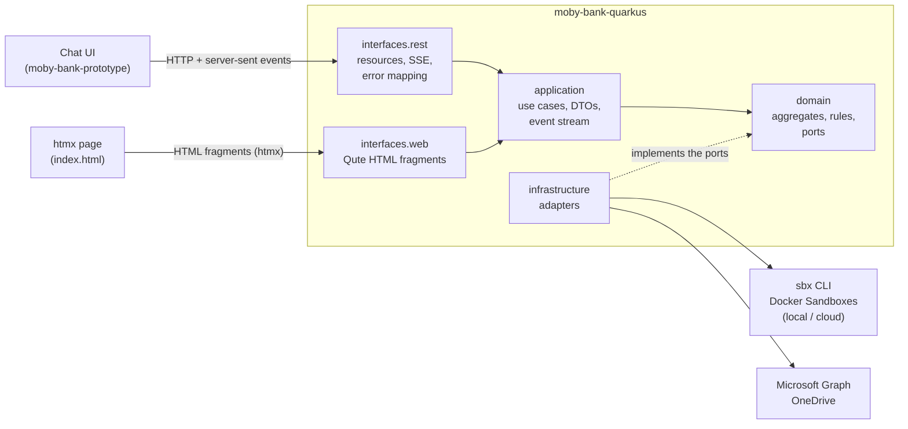
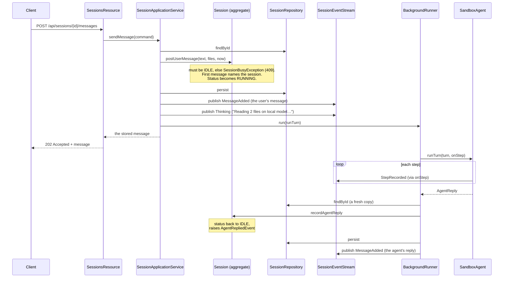
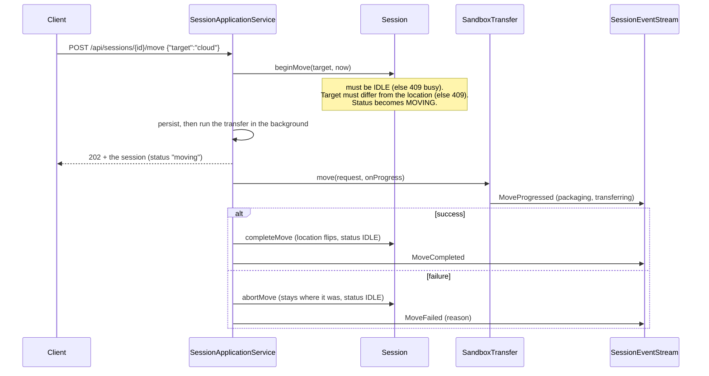
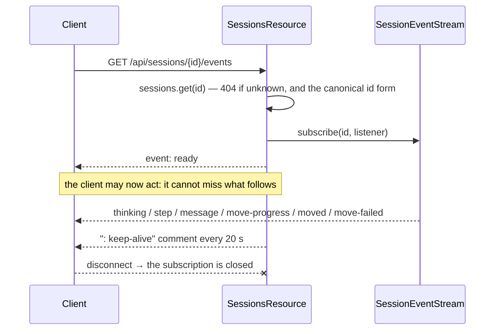
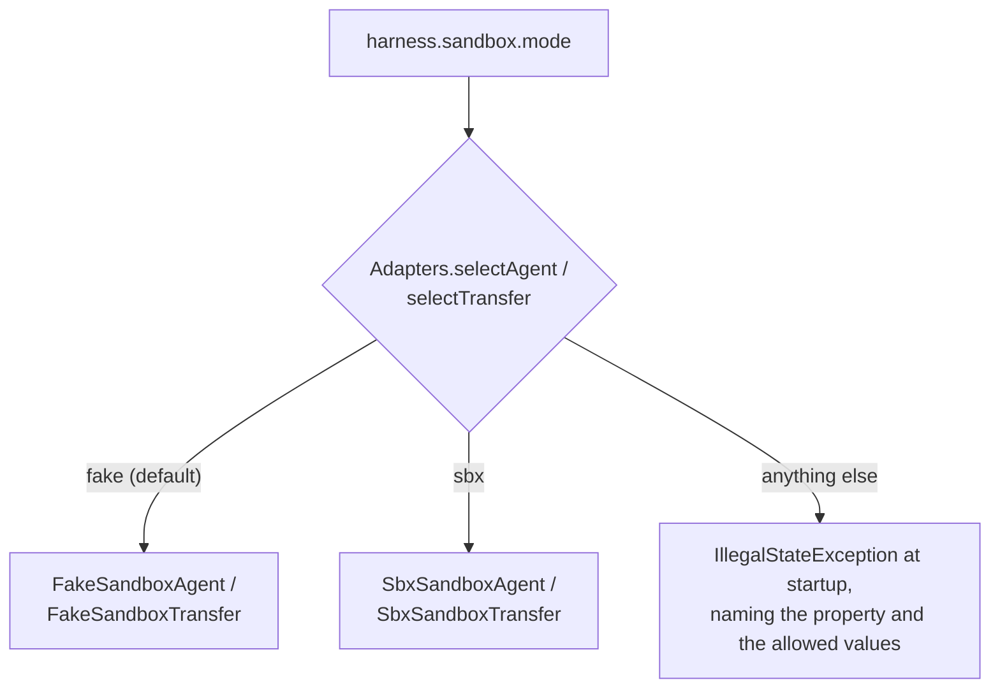

# Architecture

How the backend is put together, why, and how the important requests flow through it. Read this after the
[README](../README.md) and before the code. For the rules themselves see [domain-model.md](domain-model.md); for the
HTTP surface see [api.md](api.md).

## What the application does

An analyst chats with an **agent**. The agent works on documents (uploaded, or from **OneDrive**) and answers with a
short write-up and sometimes a table. The agent runs in a **Docker Sandbox**, either on the analyst's machine
(**local**) or in Docker's hosted service (**cloud**). A conversation (a **session**) runs in one of the two at a
time, and can be **moved** to the other, in either direction.

The backend has three jobs:

1. Keep the conversations and their rules (what may happen when).
2. Run the agent and the moves, without making the caller wait, and tell the client what is happening as it happens.
3. Reach the outside world (the sandboxes and OneDrive) through interfaces that can be swapped for fakes.

Everything the outside world provides has a fake, so the whole app runs with nothing installed. Real sandboxes and a
real OneDrive are switched on by configuration ([configuration.md](configuration.md)).

## The big picture



## The layers

Dependencies point one way. The domain depends on nothing; infrastructure depends on the domain because it implements
the domain's interfaces.

```
interfaces.rest ──┐
                  ├──▶ application ──▶ domain ◀── infrastructure
interfaces.web  ──┘
```

| Layer (package under `com.mobybank.harness`) | What it holds | May import |
|---|---|---|
| `domain` | `Session` and `ConnectedFolders` aggregates, value objects, events, exceptions, and the **ports** (interfaces for everything external) | the JDK and itself |
| `application` | `*ApplicationService` use cases, `*Command` and `*DTO` types, three small ports of its own | `domain`, CDI, config, logging |
| `infrastructure` (and `.sbx`, `.graph`) | In-memory state, the fakes, the real `sbx` and Graph adapters, and `Adapters`, which chooses between them | `domain`, `application`, frameworks |
| `interfaces.rest` | JAX-RS resources, request bodies, exception mappers | `application` (the mapper also names domain exceptions) |
| `interfaces.web` | The HTML endpoints and Qute templates behind `index.html` ([ui-fragments.md](ui-fragments.md)) | `application` only; not `interfaces.rest` |

**These rules are enforced by tests**, not by convention: `DomainLayeringTest`, `ApplicationLayeringTest`,
`InfrastructureLayeringTest`, `RestLayeringTest` and `WebLayeringTest` read the source files and fail if an import crosses a boundary.
A change that adds `jakarta.persistence` to the domain, or a domain type to a resource, fails the build.

Two naming rules go with them: a service is always an `*ApplicationService` (in `application`) or a
`*DomainService` (in `domain`), never a bare `*Service`; and a repository interface lives in the domain while its
implementation lives in infrastructure.

### Why this shape

- **The fakes are not a test convenience, they are the default.** The demo must run anywhere, so the domain talks to
  interfaces and the fakes implement them. Real sandboxes and OneDrive are just other implementations.
- **The domain can be tested with no framework.** `SessionTest` runs in milliseconds with plain `new` and assertions.
- **A second backend (Python) must match the API, not the code.** The contract is `openapi.yaml`, so the REST layer
  stays thin and the API types (`*DTO`) are separate from the domain types.

## Where things are

| Concern | Start here |
|---|---|
| The rules of a conversation | `domain/Session.java` |
| How a use case is orchestrated | `application/SessionApplicationService.java` |
| The endpoints | `interfaces/rest/SessionsResource.java`, `FoldersResource.java`, `MeResource.java` |
| The htmx page's endpoints and templates | `interfaces/web/ConversationsResource.java`, `OneDriveResource.java`, `src/main/resources/templates/` ([ui-fragments.md](ui-fragments.md)) |
| Turning failures into HTTP errors | `interfaces/rest/ApiExceptionMappers.java` |
| Choosing real vs fake | `infrastructure/Adapters.java` |
| Saved state | `infrastructure/InMemorySessionRepository.java` |
| The fake agent and demo data | `infrastructure/FakeSandboxAgent.java`, `DemoData.java` |
| Real sandboxes | `infrastructure/sbx/` ([integrations.md](integrations.md)) |
| Real OneDrive | `infrastructure/graph/` |
| The contract | `openapi.yaml` (generated at build, committed) |

## Flow 1: sending a message

The caller gets an answer as soon as the message is stored. The agent works in the background and reports through
events.



Details that matter when changing this code (all in `SessionApplicationService`):

- `sendMessage` snapshots the history **before** adding the new message and hands the agent an immutable `AgentTurn`.
  The agent never sees the live aggregate.
- The background task **reloads** the session before recording the reply. It does not keep the aggregate it loaded
  earlier, because the repository hands out copies and each save advances the version (see
  [Consistency](#consistency-and-concurrency)).
- `publish(session)` drains the aggregate's pending domain events after the save and turns them into
  `SessionEvent`s: `AgentRepliedEvent` becomes `MessageAdded` and `SessionMovedEvent` becomes `MoveCompleted`. The
  user's own message and failure messages have no domain event, so they are published directly.
- **If the agent fails** (`runTurn` catches any `RuntimeException`), `failTurn` records an assistant message
  explaining the failure (`Session.recordAgentFailure`) and frees the session. The analyst sees the reason in the
  conversation and can send again. If even that fails, it is logged and the session stays RUNNING; see the known rough
  edges in [ONBOARDING.md](ONBOARDING.md).

## Flow 2: moving a session



Moving works in both directions with **one** method because `beginMove` takes a target and only requires that it is
not the current location. There is no "move to cloud" and "move to local" in the domain, only "move to the other one".

While a session is MOVING it accepts neither a message nor another move; while it is RUNNING it accepts neither a
message nor a move. All four combinations answer 409 (see `BusyApiTest`).

## Flow 3: following a session live

`GET /api/sessions/{id}/events` returns a server-sent-events stream (`SessionsResource.events`).



- **`ready` is sent after subscribing.** A client that waits for it before sending a message cannot miss an event. It
  is also sent on every reconnect, which the UI uses as a cue to re-read the session.
- **Nothing is buffered or replayed.** `InMemorySessionEventStream` delivers to whoever is listening *now*. The
  session itself (`GET /api/sessions/{id}`) is always the source of truth; events are a notification that it changed.
- **A slow or broken listener can't hurt anyone.** Delivery catches each listener's exceptions, and the SSE side uses a
  buffering overflow strategy, so a stalled client never blocks the agent's thread.

## Consistency and concurrency

There is no database, but the code is written as if there were one, so adding one does not change the domain.

- **Aggregates are loaded, changed and saved as a whole**, one per use-case step.
- **The repositories hand out copies.** `InMemorySessionRepository` stores a private copy and returns a fresh one on
  every read, so two threads never share a mutable `Session`.
- **Optimistic versioning.** Every aggregate carries a plain `long version`. `persist` requires the stored version to
  equal the aggregate's version, then advances it by one; a mismatch throws `StaleAggregateException`, which the API
  reports as 409. Consequence: after a `persist`, reload before changing the same session again.
- **The status machine is the first line of defence.** Two concurrent sends cannot both start a turn: the second sees
  RUNNING and gets `SessionBusyException`. The version check catches anything that slips past.
- **Background work** runs on virtual threads (`VirtualThreadBackgroundRunner`), which suits the blocking calls to
  `sbx`. A task that throws is logged and never takes the runner down.
- **What survives a restart:** nothing in the app (state is in memory, and the demo data is seeded again). The real
  sandboxes keep existing and are found again by name ([integrations.md](integrations.md)).

## Choosing real or fake

`infrastructure/Adapters.java` holds CDI *producers*, one per port, that read `harness.sandbox.mode` and
`harness.documents.mode`:



Two things here surprise people:

- **The implementations are deliberately not CDI beans.** If `FakeSandboxAgent` were a bean it would be a second
  candidate for `SandboxAgent` next to the producer, and injection would be ambiguous. They are plain classes that the
  producers construct. The in-memory repositories *are* beans, because each port has only one implementation.
- **Quarkus checks every bean's injection points at startup**, even beans nothing uses. A new port therefore needs an
  implementation or a producer before the app will boot.

## How errors reach the client

| Raised as | Meaning | HTTP | `error` code |
|---|---|---|---|
| `IllegalArgumentException` | Bad input (blank text, unknown location, invalid file name) | 400 | `bad_request` |
| `ResourceNotFoundException` | Unknown session or folder | 404 | `not_found` |
| `SessionBusyException`, `InvalidMoveException`, `StaleAggregateException` | The rules say not now | 409 | `conflict` |
| `SandboxFailureException` | The sandbox failed (when it reaches the API at all) | 502 | `sandbox_failure` |
| `DocumentSourceException` | OneDrive failed or refused | 502 | `document_source_failure` |
| any other `DomainException` | A domain rule was broken | 400 | `bad_request` |

All error bodies are `{"error": "<code>", "message": "<text>"}`. The mapping lives in one place,
`ApiExceptionMappers`. Failures inside a **background** task never reach the HTTP caller (they have already been
answered with 202); they reach the client as a failure message in the conversation or a `move-failed` event.

## Design decisions and trade-offs

| Decision | Why | What it costs |
|---|---|---|
| No database; in-memory with versioning | The demo needs no infrastructure, and the repository interface keeps persistence swappable | State is lost on restart |
| Domain types kept out of the REST layer | The API must stay stable and language-neutral for the Python backend | A mapper (`Dtos`) and a second set of types |
| Fakes are the default adapters | Runs anywhere; the UI and tests need no sandbox | The fakes must be kept in step with the real behaviour |
| One `SbxCli` for local and cloud | The CLI differs only by a `--cloud` flag | The "separate adapters" idea from the spec was dropped (see the spec's `shape.md`) |
| `sbx move` for moving | The CLI moves the whole sandbox filesystem, history included | Move progress can't be observed in fine detail |
| JDK `HttpClient` for Graph | Graph paging and downloads don't fit a declarative client | A little more code |
| SSE plus a polling safety net in the UI | Live feel, resilient to a dropped stream | Two paths to reconcile state |

## Glossary

| Term | Meaning |
|---|---|
| Session / conversation | One chat with the agent: the `Session` aggregate |
| Turn | One analyst message and the agent's answer to it |
| Location | `LOCAL` (a sandbox on the analyst's machine) or `CLOUD` (Docker's hosted sandboxes) |
| Move | Carrying a session to the other location |
| Step | One entry in the agent's trace: a file read, or a calculation |
| Port | An interface the domain (or application) defines for something external |
| Adapter | An implementation of a port |
| Aggregate | A cluster of objects saved and protected as one unit |
| DTO | An API-facing copy of a domain type, using only strings and numbers |
| Sandbox | A Docker Sandbox: an isolated environment the agent runs in |
| Kit | A package that adds tools to a sandbox (see `SANDBOX-KIT.md` at the repository root) |
