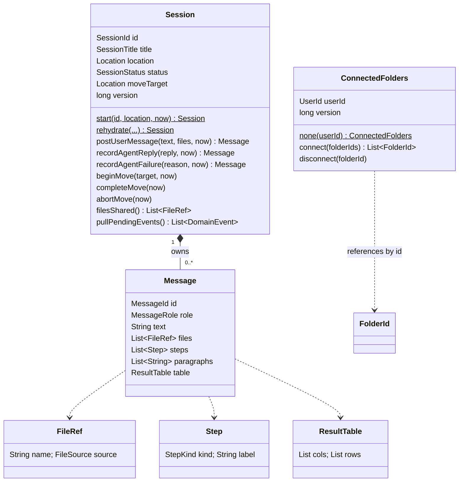
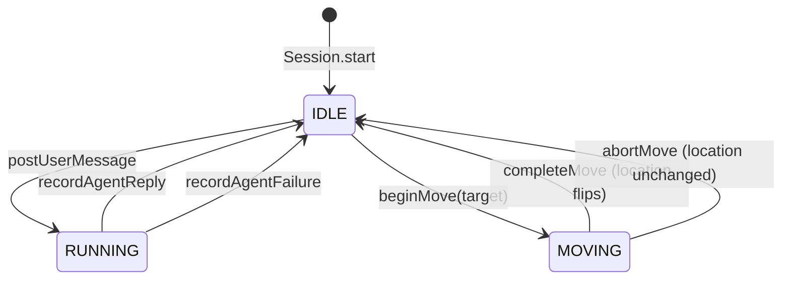

# Domain model

The rules of the application, in one package (`com.mobybank.harness.domain`). This page explains the model and the
invariants and says which test proves each. The authoritative detail is the Javadoc ([apidocs](apidocs/index.html))
and the source.

The package is plain Java: no CDI, no JAX-RS, no persistence annotations. `DomainLayeringTest` fails the build if a
domain class imports anything except the JDK or another domain class.

## The model at a glance

There are **two aggregates**. `Message` is an entity inside `Session`; everything else is a value object, an enum,
an event, an exception or a port.

| Aggregate | Identity | What it guards |
|---|---|---|
| `Session` | `SessionId` (a UUID) | The conversation's messages and title, what it is doing now (`SessionStatus`), where it runs (`Location`), and moves |
| `ConnectedFolders` | `UserId` | Which OneDrive folders one analyst has connected, in the order they were connected |

The two never reference each other by object. `ConnectedFolders` holds `FolderId`s only; the folders' names and
contents come from the `DocumentCatalog` port.

## The session state machine

Only an `IDLE` session accepts `postUserMessage` or `beginMove`; anything else throws `SessionBusyException`. The
other methods (`recordAgentReply`, `recordAgentFailure`, `completeMove`, `abortMove`) are called by the application
service to finish something it started, and throw `IllegalStateException` if the session is in the wrong state. That
is a programming error, not a user error, so it is not a `DomainException`.

## Invariants and where they are enforced

| Invariant | Enforced in | Proved by |
|---|---|---|
| A message needs text or at least one file | `Session.postUserMessage` | `SessionTest.emptyMessageWithoutFilesIsRejected` |
| Only an idle session accepts a message or a move | `Session.requireIdle` (via `postUserMessage`, `beginMove`) | `cannotPostWhileRunning`, `cannotMoveWhileRunning`, `cannotMoveTwiceAtOnce`, `cannotPostWhileMoving` |
| A move goes to the *other* location | `Session.beginMove` throws `InvalidMoveException` | `movingToTheCurrentLocationIsRejected` |
| The first message names the session (48 characters, or the first file's name if there is no text) | `Session.postUserMessage`, `SessionTitle` | `firstMessageNamesTheSessionAndStartsATurn`, `longFirstMessageGivesA48CharacterTitle`, `filesOnlyMessageGetsDefaultPromptAndFileNameTitle` |
| A message with only files gets the text "Review the attached files." | `Session.postUserMessage` | `filesOnlyMessageGetsDefaultPromptAndFileNameTitle` |
| A reply or failure is only recorded for a running turn | `Session.requireRunning` | `replyWithoutARunningTurnIsAProgrammingError` |
| A table's rows all match its columns | `ResultTable` constructor | `ValueObjectsTest.resultTableRowsMustMatchColumnCount` |
| An agent reply has at least one paragraph | `AgentReply` constructor | `ValueObjectsTest.agentReplyNeedsAParagraph` |
| A move request has different source and target | `MoveRequest` constructor | `ValueObjectsTest.moveRequestRejectsSameSourceAndTarget` |
| At least one folder must be chosen to connect; already-connected ones are ignored | `ConnectedFolders.connect` | `ConnectedFoldersTest` |
| Ids, names and labels are non-blank and trimmed | each value object's constructor | `ValueObjectsTest` |

All of these are in the aggregate or the value object itself. There is no separate validator class, so there is no
way to forget to call one.

## How aggregates are built

- **New ones** come from a factory: `Session.start(id, location, now)`, `ConnectedFolders.none(userId)`. The
  constructors are private.
- **Stored ones** are rebuilt with `rehydrate(...)`, which trusts the stored state and raises no events. Domain code
  never calls it; repositories and the demo-data seeder do.
- **Time comes in as a parameter** (`Instant now`), never from a clock inside the aggregate, so tests can fix it.
- **No setters, no public fields.** State changes only through the named methods above. Lists are returned as copies.
- **Events are collected, then drained.** `recordAgentReply` and `completeMove` append a `DomainEvent` to a private
  list. The application service calls `pullPendingEvents()` after saving, which returns and clears the list.

## Value objects

All are records, validate in the constructor, and are immutable.

| Type | Holds | Rules |
|---|---|---|
| `SessionId`, `MessageId` | A UUID | Not null; `fresh()` makes a new one (`SessionId.parse` reads text) |
| `FolderId`, `UserId` | A string | Not blank; trimmed. `UserId.DEMO` is the one fixed user, since sign-in is out of scope |
| `Location` | `LOCAL` or `CLOUD` | `other()` returns the opposite |
| `SessionStatus` | `IDLE`, `RUNNING`, `MOVING` | |
| `MessageRole` | `USER`, `ASSISTANT` | |
| `FileRef` | A file name and a `FileSource` (`UPLOAD` or `ONEDRIVE`) | Name not blank, trimmed |
| `Step` | A `StepKind` (`READ` or `COMPUTE`) and a label | Label not blank |
| `ResultTable` | Column names and rows | At least one column; every row has one cell per column; defensively copied |
| `SessionTitle` | The display title | Trimmed; not blank; cut to 48 code points (`MAX_LENGTH`) without splitting a surrogate pair |
| `AgentReply` | Steps, paragraphs, an optional table | At least one paragraph |
| `AgentTurn` | What the agent is given: session id, location, history, the new user message | The last must be a user message; history is copied |
| `MoveRequest`, `MoveProgress`, `MoveStage` | What a transfer is given, and what it reports | `MoveRequest` needs different locations |
| `Folder`, `CatalogFile` | A catalog folder and a document in it | Names not blank; counts not negative |
| `RecencyGroup` | `TODAY`, `PREVIOUS_7_DAYS`, `EARLIER` | `of(updatedAt, now, zone)` compares calendar days in the given zone; a future time counts as today |

Two modelling choices worth understanding:

- **`Message` is immutable and identified by its id.** Its `equals` compares ids only. It is built through
  `Session` (the factories are package-private), so a message cannot exist outside a session.
- **`FileRef` holds only a name and a source.** It does not remember which OneDrive folder a file came from, so
  OneDrive files are found again **by name** (`DocumentCatalog.fetch(fileName)`). That assumes names are unique.

## Events

`DomainEvent` is a sealed interface with exactly two implementations:

| Event | Raised by | When |
|---|---|---|
| `AgentRepliedEvent(sessionId, messageId)` | `Session.recordAgentReply` | The agent's reply is recorded |
| `SessionMovedEvent(sessionId, from, to)` | `Session.completeMove` | A move finishes |

Because the interface is sealed, the application service's `switch` over events has no default branch: adding a third
event makes it fail to compile until it is handled. These are *domain* events; the `SessionEvent`s the client sees
(in the `application` package) are a superset, including ones with no domain event behind them (`thinking`, `step`,
`move-progress`, `move-failed`).

## Ports

Interfaces for everything external. The domain and application call them; infrastructure implements them.

| Port | Package | Implemented by |
|---|---|---|
| `SessionRepository` | `domain` | `InMemorySessionRepository` |
| `ConnectedFoldersRepository` | `domain` | `InMemoryConnectedFoldersRepository` |
| `SandboxAgent` | `domain` | `FakeSandboxAgent`, `SbxSandboxAgent` |
| `SandboxTransfer` | `domain` | `FakeSandboxTransfer`, `SbxSandboxTransfer` |
| `DocumentCatalog` | `domain` | `FakeDocumentCatalog`, `GraphDocumentCatalog` |
| `BackgroundRunner` | `application` | `VirtualThreadBackgroundRunner` |
| `SessionEventStream` | `application` | `InMemorySessionEventStream` |
| `UploadStore` | `application` | `InMemoryUploadStore` |

The last three are in `application` because only the application layer needs them; the domain never runs work in the
background or publishes events to clients.

Two contracts are worth reading in the Javadoc:

- `SessionRepository.persist` and `ConnectedFoldersRepository.persist`: the stored version must equal the aggregate's
  version, and each save advances it (`StaleAggregateException` otherwise).
- `SandboxAgent.runTurn` calls `onStep` for each step *before* returning, which is how the client sees the agent's
  progress live.

## Exceptions

| Exception | Raised when | Becomes |
|---|---|---|
| `SessionBusyException` | A message or move is attempted on a session that is running or moving | 409 |
| `InvalidMoveException` | The move target is the current location | 409 |
| `StaleAggregateException` | A save lost a race (the aggregate changed since it was loaded) | 409 |
| `SandboxFailureException` | A sandbox port could not finish (adapters wrap their errors in it) | 502, or a failure message / `move-failed` |
| `DocumentSourceException` | The document catalog failed or refused | 502 |
| `IllegalArgumentException` | A value object or factory rejected its input | 400 |
| `IllegalStateException` | A programming error (recording a reply for a session that is not running) | 500 |

`DomainException` is the common base of the first five, so the REST layer can handle them as a family.
