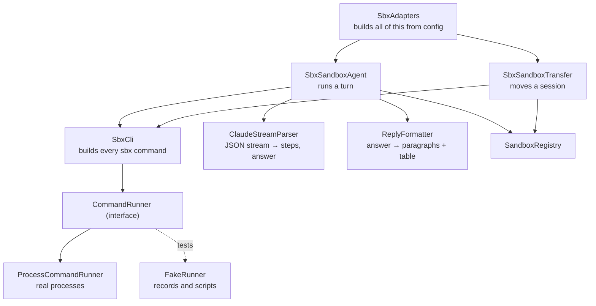

# Integrations

The two real integrations: **Docker Sandboxes** (through the `sbx` command line) and **OneDrive** (through Microsoft
Graph). Both sit behind domain ports, and the default fakes stand in for them. This page explains how each real
adapter works, what it assumes, and what to check on a real system.

> **What has and has not been verified.** The adapters are tested thoroughly against stand-ins: a fake
> `CommandRunner` for `sbx` and an in-process HTTP server for Graph. Nothing here has been run against a real `sbx`
> or a real Microsoft tenant. Treat the assumptions marked **(verify)** as the checklist for the first real run.

---

## Docker Sandboxes through `sbx`

Code: `com.mobybank.harness.infrastructure.sbx`. Selected with `harness.sandbox.mode=sbx`.

### Prerequisites on the host

- The [`sbx` CLI](https://docs.docker.com/ai/sandboxes/) installed and signed in (`sbx login`).
- For cloud: `sbx --cloud diagnose` succeeds.
- **Credentials for the agent inside the sandbox**, configured with `sbx secret`, and configured separately for cloud
  (credentials saved for local sandboxes are not available in cloud sandboxes). The sandbox's network policy must
  allow the agent's API host.
- Nothing needs to be installed in the backend's own environment beyond `sbx`; the app starts without it and a turn
  or move fails with a clear message if it is missing.

### The pieces



| Class | Responsibility |
|---|---|
| `SbxCli` | The **only** place `sbx` arguments are assembled. `CLOUD` adds the global `--cloud` flag |
| `CommandRunner` / `ProcessCommandRunner` | Run a command **without a shell** (arguments are never interpreted), close its stdin, stream its stdout line by line, keep the last 64 KiB of each stream, and kill it if it outlives its timeout |
| `SandboxRegistry` | Which sandbox currently backs each session, the agent's own conversation id, and the naming scheme |
| `ClaudeStreamParser` | Reads the agent's JSON-lines output into steps, a conversation id and the final answer |
| `ReplyFormatter` | Turns the Markdown answer into paragraphs plus the first table |
| `SbxSandboxAgent` | Implements `SandboxAgent`: one turn |
| `SbxSandboxTransfer` | Implements `SandboxTransfer`: one move |
| `SbxAdapters` / `SbxSettings` | Build the above from `harness.sbx.*` |

### The commands

Exactly these, built in `SbxCli` and asserted by `SbxCliTest`:

| Purpose | Command |
|---|---|
| Create a sandbox (no workspace mount) | `sbx [--cloud] create --name <name> [--ttl <t>] <agent>` (`--ttl` only for cloud, only if configured) |
| List sandbox names | `sbx [--cloud] ls -q` |
| Make a folder inside a sandbox | `sbx [--cloud] exec <sandbox> mkdir -p <dir>` |
| Copy a file in | `sbx [--cloud] cp <local file> <sandbox>:<remote path>` |
| Run the agent | `sbx [--cloud] exec <sandbox> <agent> -p <prompt> --output-format stream-json --verbose <agent-args> [--resume <id>]` |
| Move a sandbox | `sbx move <sandbox> --to local\|cloud --name <new name> --force [--ttl <t>]` |

`sbx move` takes no `--cloud` flag: the docs' examples address cloud sandboxes by id or name with `--to`. **(verify)**

### Sandbox names and generations

A session gets one sandbox, created on its first turn, named:

```
harness-<first 12 hex digits of the session id>-g<generation>          e.g. harness-0a1b2c3d4e5f-g0
```

Every move creates the **next generation** (`…-g1`, `…-g2`), because `sbx move` makes a new sandbox at the destination.
The service may decorate the name: a cloud sandbox can be listed as `claude/harness-0a1b2c3d4e5f-g1-k3j2x` (an agent
prefix and a short suffix). `SandboxRegistry.generationOf` reads the generation out of any of these forms, and the
full listed string is what is passed to later commands. **(verify how `sbx ls -q` prints cloud names.)**

The registry is in memory. After a restart it is empty, so both adapters **rediscover** a session's sandbox by
listing names at the right location and taking the highest generation that matches. Sandboxes therefore survive an
app restart even though the app's state does not.

### A turn (`SbxSandboxAgent.runTurn`)

1. **Find the sandbox.** Use the registry; else list and pick the highest generation; else create generation 0.
2. **Stage files** (only if the message has any): `mkdir -p <workspace-dir>/files`, then for each file read its bytes
   (`UploadStore` for uploads, `DocumentCatalog.fetch(name)` for OneDrive), write them to a temporary directory and
   `sbx cp` each in. The temporary directory is deleted afterwards. A file that is no longer available fails the
   turn with its name, before the agent runs. A name containing a path is refused.
3. **Run the agent** headless with the prompt. The prompt is a short fixed preamble ("You are a credit-research
   assistant… give exactly one Markdown table when a table helps"), then the analyst's request, then the attached
   file names and where they are. It is one argument, never split or interpreted.
4. **Stream the output.** Each stdout line goes to `ClaudeStreamParser`; every tool call becomes a step **as it
   arrives**, so the UI shows progress live.
5. **Read the result.** The answer is the `result` event's text, or, if there was none, the last assistant message.
   `ReplyFormatter` splits it into paragraphs and pulls out the first Markdown table.
6. **Remember the agent's conversation id** from the stream, so the next turn can resume.

**Resuming.** If the registry holds an agent conversation id, the run adds `--resume <id>` and the prompt omits the
history (the agent has it). If there is no id (a new sandbox, a rediscovered one, or a session whose history only
exists in this app, such as the demo conversations), the prompt includes the earlier conversation, each message
clipped to 1500 characters. **If a resumed run fails with no answer, it is retried once without `--resume`**, with
the history in the prompt.

**What counts as failure.** A run fails the turn (becoming a failure message in the conversation) if the agent's
`result` says it errored, or if the process exited non-zero *and* produced no answer. A non-zero exit *after* an
answer is ignored. The message carries the sandbox name and what the agent or `sbx` said.

### How the agent's output becomes steps

`ClaudeStreamParser` reads the JSON lines the Claude Code CLI prints with `--output-format stream-json --verbose`. It
keeps only what the UI shows and ignores the rest, so unknown events, non-JSON noise and blank lines are harmless.

| Stream event | Used for |
|---|---|
| any event with `session_id` | the agent's conversation id |
| `assistant` → `tool_use` block | a step (below) |
| `assistant` → `text` block | the fallback answer |
| `result` | the final answer and the error flag (`is_error`) |

| Tool | Step kind | Label |
|---|---|---|
| `Read` | read | the file path |
| `NotebookRead` | read | the notebook path |
| `Glob`, `Grep` | read | `glob <pattern>`, `grep <pattern>` |
| `LS` | read | `ls <path>` |
| `Bash` | compute | the command's first line |
| anything else | compute | `<Tool> <first text input>` |
| `TodoWrite` | *(skipped: bookkeeping)* | |

Labels are cut to 140 characters. **(verify the flags and the event format against the installed agent version.)**

### How the answer becomes paragraphs and a table

`ReplyFormatter.toReply`: the **first** Markdown table (a header row, then a separator row like `|---|---|`, both
starting and ending with `|`) becomes the `ResultTable`; its rows are padded or cut to the header's width. Everything
else is split on blank lines into paragraphs. A second table stays inside the paragraph text. An empty answer becomes
"The agent finished without a written answer." so the reply is always valid.

### A move (`SbxSandboxTransfer.move`)

1. Find the source sandbox (registry, else by listing at the source location). **If there is none** (the session never
   ran a turn), report "Nothing to package yet" and finish: the agent will start at the destination on its next turn.
2. Report `packaging`, then run `sbx move <source> --to <destination> --name <next generation name> --force`.
   `sbx move` captures the sandbox's whole filesystem as an image and starts a new sandbox from it. The agent's
   conversation history and any staged files travel with it, which is why a resumed turn keeps working after a move.
   Running processes and in-memory state do not travel. The source is stopped, **not deleted**.
3. Report `transferring`, then list the destination and find the sandbox of the expected generation. The destination
   may be listed with a suffix or an agent prefix; if nothing matches the move fails with a message naming the name it
   looked for.
4. Record the new sandbox in the registry.

A failed move leaves the registry unchanged, and the application service aborts the move so the session stays
where it was (`MoveFailed`).

### Things to watch on a real host

- **The source sandbox is left behind** after every move (stopped, not deleted). Nothing cleans them up.
- **Cloud sandboxes expire** (the service's default is about an hour). Set `harness.sbx.cloud-ttl` for a demo.
- **The agent runs with `--dangerously-skip-permissions`** (`harness.sbx.agent-args`) because nothing can answer a
  permission prompt in a headless run. That is acceptable only because the agent is inside a sandbox.
- **Workspace paths:** cloud sandboxes have no host workspace, so nothing is mounted and files always go in by
  `sbx cp`.

---

## OneDrive through Microsoft Graph

> This section describes the adapter as it is today. The plan for using it against a real tenant, per user, with governance,
> is [ONEDRIVE_INTEGRATION.md](ONEDRIVE_INTEGRATION.md).

Code: `com.mobybank.harness.infrastructure.graph`. Selected with `harness.documents.mode=graph`.

### Authentication

`GraphTokenProvider` supplies the bearer token in one of two ways:

- **A configured token** (`harness.graph.access-token`): used as-is. Quick for a demo (a token from Graph Explorer with
  `Files.Read.All`), but it expires in about an hour.
- **Client credentials** (`tenant-id`, `client-id`, `client-secret`): a POST to the token endpoint with the
  client-credentials grant and scope `https://graph.microsoft.com/.default`. The token is cached and refreshed in the
  last minute before it expires. Register an Entra app, grant the **application** permission `Files.Read.All` with
  admin consent, and set `harness.graph.drive` to `users/<upn>/drive` or `drives/<id>`: an app-only token has no
  signed-in user, so `me/drive` does not work.

There is no per-user sign-in: every analyst sees the one configured drive. Misconfiguration (neither a token nor
full credentials) stops the app at startup. An error from the token endpoint is reported with its first line only,
and **the client secret never appears in an error message**.

### What it calls

| Purpose | Request |
|---|---|
| The folder library | `GET <drive>/root/children` (or `root:/<folders-root>:/children`) with `$select=id,name,folder,parentReference&$orderby=name&$top=200`; keeps items that have a `folder` facet |
| A folder's documents | `GET <drive>/items/<id>/children` with `$select=id,name,file&$orderby=name&$top=200`; keeps items that have a `file` facet |
| Find a document by name | `GET <drive>/root/search(q='<name>')` (a quote in the name is doubled); keeps an exact-name match, preferring one inside `folders-root` |
| Get its download link | `GET <drive>/items/<id>?$select=id,name,size,@microsoft.graph.downloadUrl` |
| Download | a plain `GET` of that pre-authenticated URL, **without** the bearer token |

A folder's `path` in the API (for example "Credit Research / Coverage / Earnings 2026") is built from the item's
`parentReference.path` (percent-decoded) plus its name. `fileCount` is the folder's `childCount`.

### Safety and limits

- **The bearer token goes only to the configured Graph host.** Paging follows `@odata.nextLink`, and a link to any
  other origin (another host **or another port**) is refused without being contacted. Redirects are not followed.
- **Listings are capped at 25 pages** of 200, so a listing that never ends is cut off.
- **Files over `harness.graph.max-download-bytes`** (default 50 MiB) are refused before downloading.
- **Errors** become `DocumentSourceException` (HTTP 502 from the API): 401 and 403 suggest checking the token or app
  permissions; 429 says it is throttled; Graph's own message is included; a body that is not JSON is an error; an
  unreachable Graph says so.
- **Names are assumed unique.** `DocumentCatalog.fetch` finds a file by name alone; with duplicates it returns the
  first match (or one under `folders-root`).

There is no caching: each library or file listing is a fresh request.
